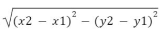
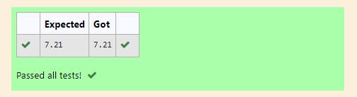

# DISTANCE-BETWEEN-TWO-POINTS

## AIM:
To write a python program to find the distance two 2 points
## ALGORITHM:
### Step 1: 
Get 4 inputs from the user.
### Step 2: 
Classify with x1,x2 and y1,y2 points.
### Step 3
Import math module.
### Step 4: 
Substitute the values in the distance formula.
##
### Step 5: 
Display the output using format function.

### PROGRAM:
  ```
  x1,x2=10,4
y1,y2=6,2
import math
value=math.sqrt((x2-x1)**2+(y2-y1)**2)
print("{:.2f}".format(value))
  ```
## Output:

## Result:
Thus the Distance Between The Two points are successfully executed!!!
